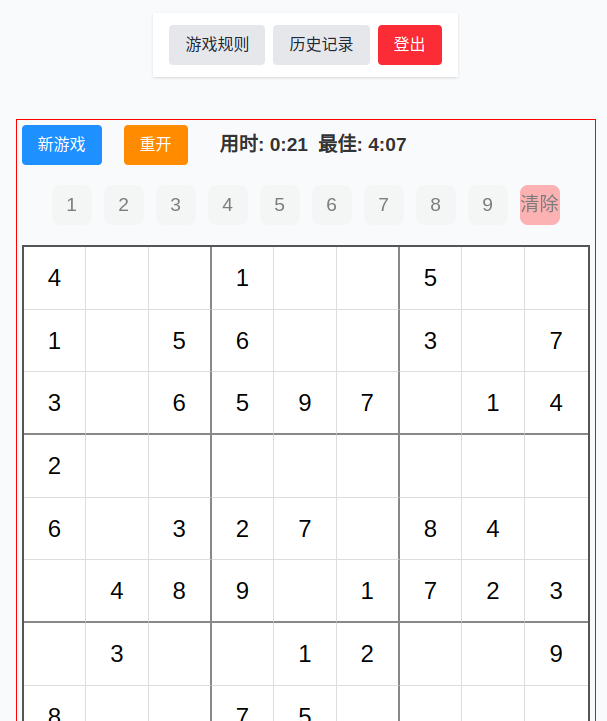

# Sudoku Game (v1.0.0)

一个基于Next.js的在线数独游戏，具有以下功能：
- 随机生成数独谜题
- 实时验证输入
- 计时和最佳成绩记录（登录用户从数据库获取，未登录用户从cookie获取）
- 三种难度级别选择（简单:40-45初始数字，中等:30-35，困难:25-30）
- 用户认证和历史记录
- 响应式设计，适配各种设备
- 新游戏/重开功能
- 游戏完成自动保存记录



## 主要技术栈
- **框架**: Next.js 15.3 (App Router模式)
- **语言**: TypeScript 5
- **UI库**: React 19
- **样式**: TailwindCSS + CSS Modules
- **状态管理**: React组件状态 + Supabase Auth
- **认证服务**: Supabase Auth
- **构建工具**: Next.js内置构建系统
- **代码规范**: ESLint + Next.js默认规则
- **部署**: Docker容器化

## 游戏历史记录功能
- **数据存储**: 
  - 登录用户: 使用Supabase数据库存储游戏记录
  - 未登录用户: 使用浏览器cookie存储最佳成绩
- **记录内容**: 
  - 游戏难度
  - 完成时间(秒)
  - 完成日期
  - 用户ID(仅登录用户)
- **展示方式**: 
  - 按完成时间倒序排列
  - 显示最近10条记录(仅登录用户)
  - 格式化显示用时(分:秒)
  - 实时显示当前游戏用时
  - 显示最佳成绩(登录用户从数据库获取，未登录用户从cookie获取)
- **自动更新**: 
  - 游戏完成时自动保存记录
  - 自动更新最佳成绩(如果打破记录)
- **最佳成绩**: 
  - 登录用户: 从数据库查询历史最快完成时间
  - 未登录用户: 从cookie获取最佳成绩
  - 格式化为"分钟:秒"(秒数小于10补零)

## 架构设计
1. **前端架构**
   - 基于Next.js App Router的混合应用架构
     * 包含多个独立路由页面
     * 每个页面有自己的客户端交互逻辑
     * 共享全局布局和状态管理
   - 主要特性:
     * 使用App Router组织路由结构
     * 全局布局(layout.tsx)管理认证状态和字体
     * 主页面(page.tsx)渲染游戏组件
     * 使用CSS Modules和TailwindCSS实现样式
   - 渲染能力:
     * 服务端组件(Server Components)用于认证API路由
     * 客户端组件(Client Components)用于交互逻辑
   - 响应式设计:
     * 适配移动端和桌面设备
     * 使用TailwindCSS响应式断点

2. **核心功能实现**
   - 数独生成算法: 
     * 使用回溯算法生成完整解
     * 随机填充对角线3x3宫格作为初始状态
     * 根据难度级别移除不同数量的数字
   - 游戏逻辑: 
     * 实时验证输入有效性
     * 高亮显示相同数字和错误输入
     * 自动计时和完成检测
   - 用户认证: 
     * 基于Supabase的邮箱/密码认证
     * 使用SessionContext管理认证状态
   - 数据持久化:
     * 游戏记录存储到Supabase数据库
     * 使用useEffect自动同步最佳成绩
   - 状态管理:
     * 使用React状态管理游戏棋盘和计时器
     * 使用useCallback优化性能

3. **状态管理与数据流**
   - 全局状态: 
     * 认证状态: 使用Supabase的SessionContextProvider管理
     * 用户数据: 通过Supabase实时查询
   - 组件状态:
     * 游戏状态: 使用React useState管理棋盘、计时器等
     * 使用useEffect处理副作用(定时器、数据获取)
     * 使用useCallback优化回调函数性能
     * 使用useRef跟踪特殊状态(如游戏完成状态)
   - 数据流:
     * 单向数据流设计
     * 通过props传递数据
     * 子组件通过回调函数通知父组件状态变化
   - 状态持久化:
     * 游戏记录存储在Supabase数据库
     * 使用浏览器本地存储缓存部分状态

4. **错误处理策略**
   - API错误处理: 
     * 认证API返回标准HTTP状态码(401未授权/400错误请求)
     * 统一错误消息格式: { error: string }
   - 前端错误展示: 通过页面内提示和状态反馈显示错误信息

5. **性能优化**
   - 已实现优化:
     * 代码分割: 使用Next.js自动代码分割
     * 静态资源优化: 所有图片已压缩
     * SVG优化: 使用SVGR处理SVG图标
   - 待实现优化:
     * 路由懒加载
     * 服务端缓存配置
   - 当前性能指标(基于Chrome DevTools测试):
     * 首屏加载时间: ~1.5s (生产环境, Lighthouse测试)
     * 数独生成时间: ~50ms (console.time测量)
     * 游戏交互响应时间: <100ms (React Profiler测量)
   - 测试方法:
     * 开发环境: Chrome DevTools Performance面板
     * 生产环境: Lighthouse测试报告
     * 关键函数: console.time/timeEnd
     * React组件: React DevTools Profiler

6. **测试策略**
   - 当前版本暂未实现自动化测试
   - 未来计划添加Jest单元测试和Cypress E2E测试
   - 目前通过手动测试验证核心功能:
     * 数独生成算法
     * 游戏规则验证
     * 用户认证流程
     * 历史记录存储

## 项目结构
```
.
├── src/
│   ├── app/                  # Next.js App Router入口
│   │   ├── components/       # 页面组件
│   │   │   ├── GameHistory.tsx  # 游戏历史记录组件
│   │   │   ├── GameHistory.d.ts # 历史记录类型定义
│   │   │   ├── LoginForm.tsx    # 登录表单组件
│   │   │   ├── NavBar.tsx       # 导航栏组件
│   │   │   ├── Sudoku.tsx       # 数独游戏主组件
│   │   │   ├── SudokuBoard.tsx  # 数独棋盘组件
│   │   │   ├── Sudoku.module.css # 游戏样式
│   │   │   ├── Sudoku.d.ts      # 游戏类型定义
│   │   ├── utils/            # 工具函数
│   │   │   └── sudoku.ts      # 数独生成和验证算法
│   │   ├── api/              # API路由
│   │   │   └── auth/         # 认证相关
│   │   │       ├── signin/route.ts    # 登录API
│   │   │       └── signup/route.ts    # 注册API
│   │   ├── auth/             # 认证页面
│   │   │   └── callback/route.ts # 认证回调处理
│   │   ├── game/             # 游戏页面
│   │   │   └── page.tsx      # 游戏主页面
│   │   ├── history/          # 历史记录页面
│   │   │   └── page.tsx      # 历史记录页面
│   │   ├── rules/            # 游戏规则页面
│   │   │   └── page.tsx      # 规则说明页面
│   │   ├── layout.tsx        # 应用布局组件
│   │   └── page.tsx          # 首页
│   ├── components/           # 共享组件
│   │   └── AuthButtons.tsx   # 认证按钮组件
│   ├── lib/                  # 共享库
│   │   └── supabase.ts       # Supabase客户端配置
│   ├── providers/            # 上下文提供者
│   │   └── AuthProvider.tsx  # 认证状态管理
│   └── styles/               # 全局样式
│       ├── globals.css       # 全局CSS
│       └── Sudoku.module.css # 数独游戏样式
├── public/                   # 静态资源
│   ├── sudoku-screenshot.png # 游戏截图
│   ├── next.svg              # Next.js logo
│   └── vercel.svg            # Vercel logo
├── Dockerfile                # 容器化配置
├── package.json              # 项目配置
└── README.md                 # 项目文档
```
```

## 认证系统配置
1. **Supabase设置**
```bash
# 安装Supabase客户端
npm install @supabase/supabase-js @supabase/auth-helpers-react @supabase/auth-helpers-nextjs
```

2. **环境变量配置**
```env
NEXT_PUBLIC_SUPABASE_URL=your-supabase-url
NEXT_PUBLIC_SUPABASE_ANON_KEY=your-anon-key
```

3. **启用认证方式**
- 登录Supabase控制台 → Authentication → Providers
- 启用"Email"认证方式
- 配置SMTP服务发送验证邮件
- 邮件验证URL生成:
  - 主机名来自环境变量NEXT_PUBLIC_SITE_URL
  - 回调路径固定为`/auth/callback`
  - 完整示例: `http://localhost:3000/auth/callback` (开发环境)
  - 生产环境应设置为实际部署域名

## 数据库初始化

```sql
-- 创建游戏历史记录表
CREATE TABLE public.game_history (
  id UUID PRIMARY KEY DEFAULT gen_random_uuid(),
  user_id UUID REFERENCES auth.users(id) ON DELETE SET NULL,
  difficulty TEXT NOT NULL,
  time_seconds INTEGER NOT NULL,
  completed_at TIMESTAMPTZ NOT NULL DEFAULT NOW(),
  is_completed BOOLEAN NOT NULL DEFAULT TRUE
);

-- 启用RLS(行级安全，可选)
ALTER TABLE public.game_history ENABLE ROW LEVEL SECURITY;

-- 创建查询索引(可选)
CREATE INDEX idx_game_history_user_id ON public.game_history(user_id);
CREATE INDEX idx_game_history_completed_at ON public.game_history(completed_at);
```

## 快速开始

1. **安装依赖**
```bash
npm install
```

2. **开发环境**
```bash
npm run dev  # 启动开发服务器(端口3003)
```

3. **生产构建**
```bash
npm run build  # 生成优化后的生产版本
npm start      # 启动生产服务器
```

4. **游戏功能**
- 点击格子选择位置
- 使用数字键盘或屏幕按钮输入数字
- 点击"新游戏"重新开始(生成全新谜题)
- 点击"重开"重置当前游戏(保留原谜题)
- 实时显示当前游戏用时
- 显示历史最佳成绩(登录用户从数据库获取，未登录用户从cookie获取)

3. **环境变量配置**
创建 `.env.local` 文件并配置以下变量：

```env
# Supabase配置 (从Supabase项目设置获取)
NEXT_PUBLIC_SUPABASE_URL=your-project-url.supabase.co
NEXT_PUBLIC_SUPABASE_ANON_KEY=your-anon-key

# 各变量说明：
# - NEXT_PUBLIC_SUPABASE_URL: 
#   从Supabase控制台 → Settings → API获取
#   格式: https://[project-ref].supabase.co

# - NEXT_PUBLIC_SUPABASE_ANON_KEY:
#   从Supabase控制台 → Settings → API获取
#   用于客户端匿名访问

# - NEXT_PUBLIC_SITE_URL:
#   应用部署的主机名，用于生成邮件验证链接
#   开发环境: http://localhost:3000
#   生产环境: https://your-domain.com
```

4. **容器化部署**
```bash
# 构建镜像 (包含环境变量)
docker build -t sudoku-app .

# 运行容器 (传递环境变量)
docker run -d --name sudoku-app \
  -p 3000:3000 \
  -e NEXT_PUBLIC_SUPABASE_URL=$NEXT_PUBLIC_SUPABASE_URL \
  -e NEXT_PUBLIC_SUPABASE_ANON_KEY=$NEXT_PUBLIC_SUPABASE_ANON_KEY \
  sudoku-app
```

5. **生产环境部署最佳实践**
- 使用 Docker Compose 管理多容器部署
- 将敏感信息存储在 secrets 或 vault 中
- 配置 HTTPS 和 HTTP/2
- 设置适当的资源限制
- 配置健康检查和自动重启

6. **Nginx反向代理配置**
```nginx
# 反向代理配置
server {
    listen 80;
    server_name your-domain.com;

    location / {
        proxy_pass http://localhost:3000;
        proxy_set_header Host $host;
        proxy_set_header X-Real-IP $remote_addr;
        proxy_set_header X-Forwarded-For $proxy_add_x_forwarded_for;
        proxy_set_header X-Forwarded-Proto $scheme;
    }
}
```

6. **Docker Compose 示例**
```yaml
version: '3.8'
services:
  app:
    image: sudoku-app
    environment:
      - NEXT_PUBLIC_SUPABASE_URL=${SUPABASE_URL}
      - NEXT_PUBLIC_SUPABASE_ANON_KEY=${SUPABASE_KEY}
    ports:
      - "3000:3000"
    restart: unless-stopped
    healthcheck:
      test: ["CMD", "curl", "-f", "http://localhost:3000/api/health"]
      interval: 30s
      timeout: 10s
      retries: 3
```

## 技术选型理由
1. **Next.js优势**
   - 开箱即用的React框架
   - 优秀的SEO支持
   - 高效的构建系统
   - 简单的部署选项

2. **TypeScript**
   - 提供类型安全
   - 更好的代码维护性
   - 完善的IDE支持

3. **TailwindCSS**
   - 原子化CSS方案
   - 快速UI开发
   - 与React完美配合
